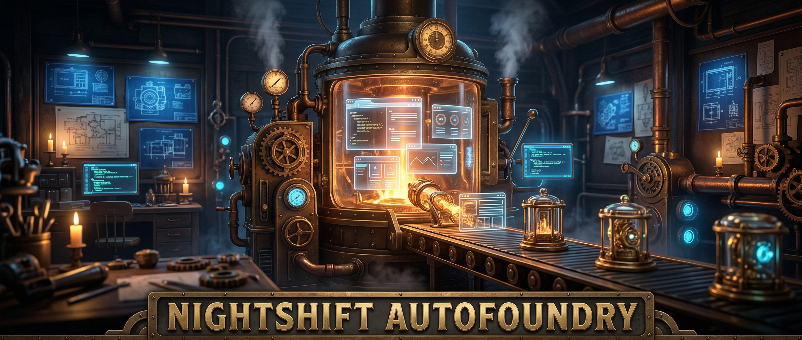

<p align="center">
  
</p>

# Nightshift AutoFoundry (NSAF)

A personal app factory that generates, builds, and deploys web applications autonomously. Every morning, AI surfaces curated app ideas. You pick the ones you like. NSAF handles the rest — speccing, coding, testing, and deploying each one without human intervention.

## How It Works

1. **Morning ideas** — A cron job generates 30 app ideas from three AI models (OpenAI, Gemini, Anthropic), each with escalating creativity levels
2. **You select** — Browse the ideas in a web UI and check the ones you want built
3. **NSAF builds** — The orchestrator queues your selections and spawns autonomous coding sessions that build each app end-to-end
4. **You review** — Finished apps are deployed locally with a QA checklist. Approve them through a Webex chatbot
5. **Promote to production** — Approved apps are deployed to Render with a single command

## Architecture

```
┌─────────────────────────────────────────────────┐
│                  Ubuntu Server                   │
│                                                  │
│  Cron ──→ Idea Generator (Python)               │
│              ↓                                   │
│  Flask App (Python)                              │
│    ├── Idea selection UI                         │
│    ├── QA review pages                           │
│    └── Webex chatbot                             │
│              ↓ (SQLite)                          │
│  Orchestrator (Node.js)                          │
│    ├── Queue manager                             │
│    ├── Port allocator (5020-5999)                │
│    ├── PostgreSQL provisioner                    │
│    ├── Session spawner (Claude Code)             │
│    ├── State monitor + stall detection           │
│    └── Evening digest                            │
│              ↓                                   │
│  Local deployments ──→ Render (on promotion)     │
└─────────────────────────────────────────────────┘
```

NSAF is three processes communicating through a shared SQLite database:
- **Orchestrator** (Node.js) — manages the build queue, spawns coding sessions, monitors progress
- **Flask App** (Python) — serves the idea selection UI, QA pages, and Webex bot
- **Idea Generator** (Python) — runs daily via cron to produce ideas and send the morning email

## Prerequisites

- Ubuntu 22.04+ server
- Node.js 20+
- Python 3.12+
- PostgreSQL 15+
- [Claude Code CLI](https://docs.anthropic.com/en/docs/claude-code) — installed, authenticated, and licensed
- Webex bot token (create at [developer.webex.com](https://developer.webex.com))
- [Resend](https://resend.com) account for email delivery
- API keys for OpenAI, Google (Gemini), and Anthropic

## Quick Start

```bash
# Clone
git clone <repo-url> /opt/nsaf
cd /opt/nsaf

# Configure
cp .env.example .env
# Edit .env — fill in all API keys and settings

# Run setup
bash scripts/setup.sh

# Start services
sudo systemctl start nsaf-orchestrator nsaf-flask

# Test idea generation
source venv/bin/activate
python idea-generator/generate.py --dry-run
```

## Configuration

### Environment Variables

All configuration lives in `.env`. See `.env.example` for the full list with descriptions.

Key settings:

| Variable | Description | Default |
|----------|-------------|---------|
| `NSAF_CONCURRENCY` | Max simultaneous build sessions | `2` |
| `NSAF_PORT_RANGE_START` | Start of port range for local deployments | `5020` |
| `NSAF_PORT_RANGE_END` | End of port range | `5999` |
| `NSAF_STALL_TIMEOUT_MINUTES` | Minutes before a build is flagged as stalled | `30` |
| `NSAF_PROJECTS_DIR` | Where generated projects are stored | `./projects` |

### Preferences

Edit `preferences.md` to control what NSAF builds:

```markdown
## Idea Categories
- sports
- fitness
- education

## Exclusions
- gambling

## Tech Stack
- Frontend: React
- Backend: Node.js
- Database: PostgreSQL

## Complexity Range
- Minimum: medium
- Maximum: high
```

No code changes needed — just edit the file and the next morning's ideas will reflect your preferences.

## Webex Bot Commands

Control NSAF from your phone or desktop through Webex:

| Command | Description |
|---------|-------------|
| `status` | Queue depth, active builds, recent completions |
| `pause` | Stop pulling new projects from the queue |
| `resume` | Resume pulling from the queue |
| `skip <slug>` | Remove a project and mark as scrapped |
| `restart <slug>` | Re-queue a stalled or failed project |
| `promote <slug>` | Deploy a reviewed app to Render |
| `help` | Show all commands |

## Project Lifecycle

Each app moves through these states:

```
queued → building → deployed-local → reviewing → promoted
                                               → scrapped
```

- **queued** — Waiting for a build slot
- **building** — Claude Code session is running the build pipeline
- **deployed-local** — Build complete, running on the server for QA
- **reviewing** — You're testing it with the QA checklist
- **promoted** — Deployed to Render
- **scrapped** — Rejected and cleaned up (ports + database reclaimed)

## Notifications

- **Webex** (real-time) — Stall alerts, build completions, deployment confirmations
- **Email** (scheduled) — Morning idea list, evening digest with the day's results

## Running Tests

```bash
# Node.js tests (orchestrator)
cd orchestrator && node --test tests/

# Python tests (shared + idea generator)
PYTHONPATH=. python3 -m pytest shared/tests/ idea-generator/tests/

# Flask tests
PYTHONPATH=.:flask-app python3 -m pytest flask-app/tests/

# Cross-language integration
PYTHONPATH=. python3 -m pytest tests/
```

## Project Structure

```
nsaf/
├── orchestrator/           # Node.js — queue, spawning, monitoring
│   ├── src/
│   │   ├── index.js        # Main loop + systemd entry point
│   │   ├── db.js           # SQLite interface
│   │   ├── queue.js        # Queue management
│   │   ├── ports.js        # Port allocation
│   │   ├── postgres.js     # Per-app database provisioning
│   │   ├── scaffolder.js   # Project directory setup
│   │   ├── spawner.js      # Claude Code session launcher
│   │   ├── poller.js       # STATE.md polling
│   │   ├── stall.js        # Stall detection
│   │   ├── completion.js   # Build completion handler
│   │   ├── notify.js       # Webex notifications
│   │   ├── digest.js       # Evening digest
│   │   └── promotion.js    # Render promotion
│   └── tests/
├── flask-app/              # Python — web UI + Webex bot
│   ├── app.py
│   ├── routes/             # select, review, webex
│   ├── bot/                # commands, notifications
│   ├── templates/          # HTML templates
│   └── tests/
├── idea-generator/         # Python — multi-model idea generation
│   ├── generate.py         # Cron entry point
│   ├── prompt.py           # Prompt construction + temperature
│   ├── providers/          # openai, gemini, anthropic
│   └── tests/
├── shared/                 # Python — shared SQLite + config
├── scripts/                # setup.sh, register-webhook.sh
├── systemd/                # Service files
├── preferences.md          # What to build
└── .env.example            # All configuration
```

## License

Private project — not for redistribution.
