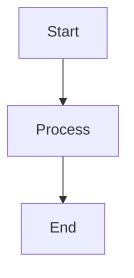

# Chapter Format Reference

This template shows the expected structure for chapter markdown files
produced by `/sws:write` and enhanced by `/sws:diagrams`.

```markdown
## Chapter {N}: {Title}

### Learning Objectives

- Objective 1
- Objective 2
- Objective 3

### {Section Title}

#### {Sub-topic}

Content paragraph with factual information from research.
Use inline citations: [Source: https://example.com]

Every major concept should have a concrete real-world example.

> **Key Takeaway:** 2-3 sentence recap of this section.

#### {Next Sub-topic}

More content...

**Figure {N}.{n}: {Description}**


### {Next Section Title}

...

### Chapter Summary

Brief synthesis of the chapter's key points and how they connect
to the broader topic.

### Key Terms

| Term | Definition |
|------|-----------|
| Term 1 | Clear, concise definition |
| Term 2 | Clear, concise definition |
```

## Heading Hierarchy

- `##` — Chapter title (h2)
- `###` — Section title (h3)
- `####` — Sub-section / sub-topic (h4)

## Citation Format

Inline: `[Source: url]`

## Diagram Labels

`**Figure {chapter_number}.{diagram_number}: {description}**`

Followed immediately by a mermaid code block.

## Diagram Count

Minimum 2, maximum 6 per chapter (added by /sws:diagrams).
